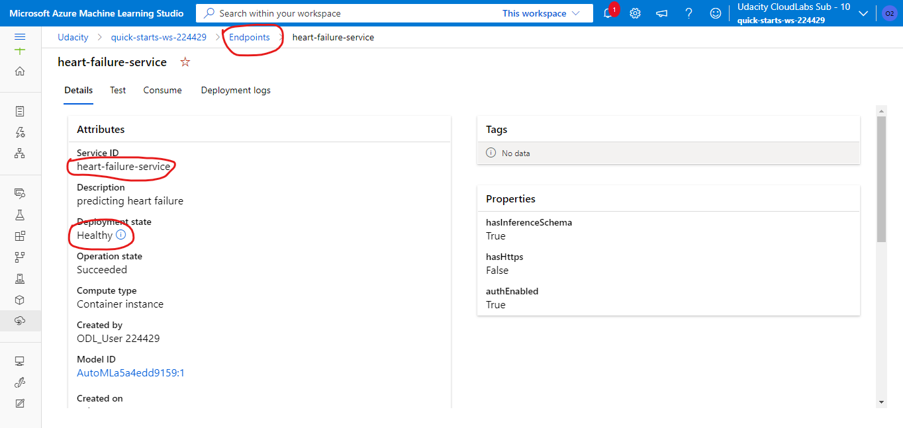

# Heart Failure Prediction
In this project, I am building a model that can accurately classify between patients that died by heart failure and those that didin't. You could be wondering why this is neccesary; but main goal of this project is to create a model that can be used to detecting patients at high risk of fatality from high blood pressure.

## Project Architecture


## Project Set Up and Installation
In this project, I created a compute instance (for running our notebooks) and a compute instance from the Azure ML studio console for deploying my model and performing experiments. I also loaded the [dataset](https://www.kaggle.com/datasets/andrewmvd/heart-failure-clinical-data) from my local drive into the datastore.

## Dataset
[data](https://www.kaggle.com/datasets/andrewmvd/heart-failure-clinical-data)

### Overview
The dataset was gotten from [kaggle](https://www.kaggle.com/datasets/andrewmvd/heart-failure-clinical-data) and includes 12 features for predicting heart failure. This dataset includes 299 observations, 96 of which includes fatal patient.

### Task
we will be create a classification model that can accurately predict fatality from heart disease first by creating an autoML experiment and hyperparameter tuning of Logistic Regression.

### Access
In accessing the workspace that was used for the project, I navigated to the azure portal and created an workspace Ml workspace with all neccesary requirements. I logged into my workspace and downloaded the config.json file which was used to specify my workspace during the project.

## Automated ML
For the configuration of the AutoMl experiement. Due to limited resources, I set the timeout to 30minutes. The primary metric is also set to accuracy. The target columns was also specified and the tack had bee set into classification. I have also set the exported model to be ONNX compatible. Its is important to note that improvements can be made to this model. Innitially i said we could increase the timeout time. Another technique can be to focus not on model accuaracy, but model precision because even if this models are able to predict all the DEATH_EVENT classes as 0(i.e, Not death), the model will still have an high accuracy since there are more 0's than 1's in the dataset.


### Results
The autoMl experiment provided us with a model with its accuracy of 88%
```
Best run: Run(Experiment: ml-exp,
Id: AutoML_a5a4edd9-1f2f-42fd-9cab-60df0b1cd4a9_59,
Type: azureml.scriptrun,
Status: Completed)
Best fitted model: Pipeline(memory=None,
         steps=[('prefittedsoftvotingclassifier',
                 PreFittedSoftVotingClassifier(classification_labels=array([0, 1]), estimators=[('42', Pipeline(memory=None, steps=[('SparseNormalizer', Normalizer(copy=True, norm='l2')), ('XGBoostClassifier', XGBoostClassifier(booster='gbtree', colsample_bytree=0.6, eta=0.2, gamma=0.1, max_depth=8, max_leaves=0, n_est...7708333333333335, reg_lambda=2.3958333333333335, subsample=0.6, tree_method='auto'))], verbose=False))], flatten_transform=None, weights=[0.09090909090909091, 0.09090909090909091, 0.09090909090909091, 0.09090909090909091, 0.09090909090909091, 0.09090909090909091, 0.09090909090909091, 0.18181818181818182, 0.09090909090909091, 0.09090909090909091]))],
         verbose=False)

```
## Hyperparameter Tuning
 For this part of the project I chose LogisticRegression as the model to be tuned because it historically performs really good on classification. I oprimized the model using the "C" and the "max_iter". Below is the code sample
 ```
 policy = BanditPolicy(evaluation_interval=2, slack_factor=0.1)

#TODO: Create the different params that you will be using during training
ps = RandomParameterSampling({
    '--C': uniform(0.01, 0.1),
    '--max_iter': choice(10, 20, 50, 100, 250)
})
 ```
### Results
In our hyper parameter search, the best accuracy was 80% which is lower than that of the AutoMl model. we can definitely improve this method by choosing a different algorithm for the experiment.


## Model Deployment
The model from the automl config was used deployed as a webservice because it had a higher accuracy. 
Below is an overview of the deployed model.


To query this model, a requent can be sent to its Rest API endpoint json payload and also including its access token and its return a value of either 1 or 0.
eg:
```
data = {
    "data":
    [
        {
            'age': "40",
            'anaemia': "0",
            'creatinine_phosphokinase': "315",
            'diabetes': "1",
            'ejection_fraction': "20",
            'high_blood_pressure': "0",
            'platelets': "162000",
            'serum_creatinine': "2.7",
            'serum_sodium': "500",
            'sex': "0",
            'smoking': "0",
            'time': "10",
        },
    ],
}
```


## How to improve the project in the future
In a future project. we can decide to increase the time out of the AutoML model which although consumes a lot of resources, could provide us with a more accurate model. Also, we could change the primary metric from accuracy to precision to mitigate possible model bias to a particular class.

## Screen Recording
[Link to recording](https://drive.google.com/file/d/1fYRqO6xzmKY5gqsnNsz-fZDjez0IT_t3/view?usp=sharing)
